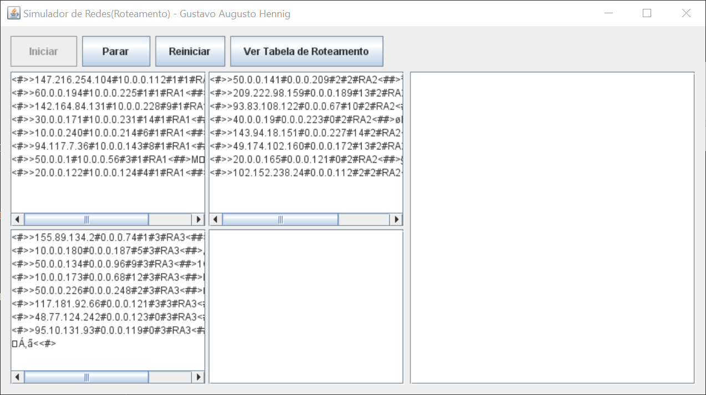
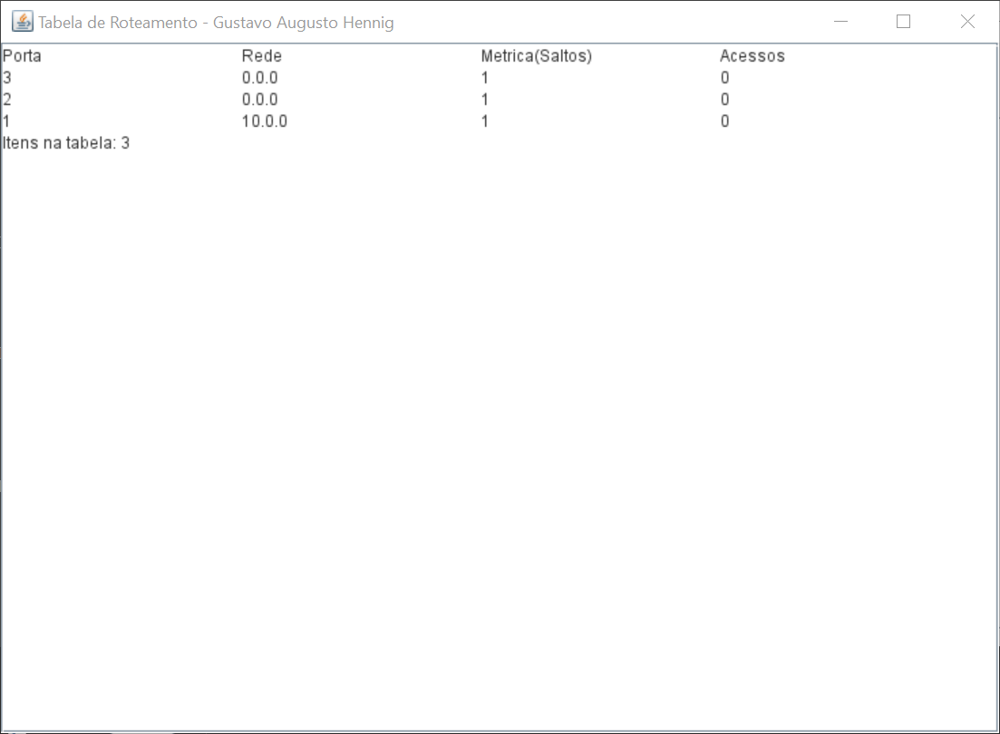

Simulador de Redes(Roteamento) 1.0
==================================

Trabalho acadêmico da disciplina de redes (Ciência da computação).  
Simula um roteador de quatro portas, com um protocolo de atualização de tabela de roteamento.


#### Instalação/Execução:

O programa foi feito utilizando a ferramenta Netbeans, pode ser executado pelo Netbeans ou através do arquivo jar, localizado em: \dist\SimuladorRedes.jar

 
#### Protocolos utilizados:

Dados:
```
 <#>>IP destino#IP origem#TTL#Porta<##>DADOS<<#>
```
Atualização da Tabela de roteamento:
```
<#>>Ação(não utilizado)#Endereço da rede#Métrica#Porta<<#>
```



 

Gustavo Augusto Hennig

29/10/2008
